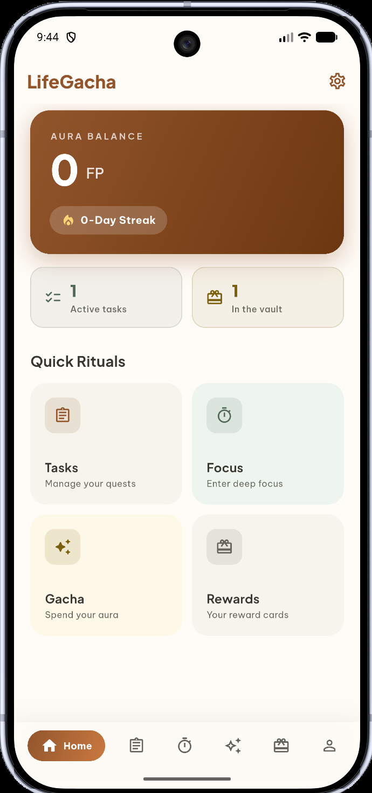
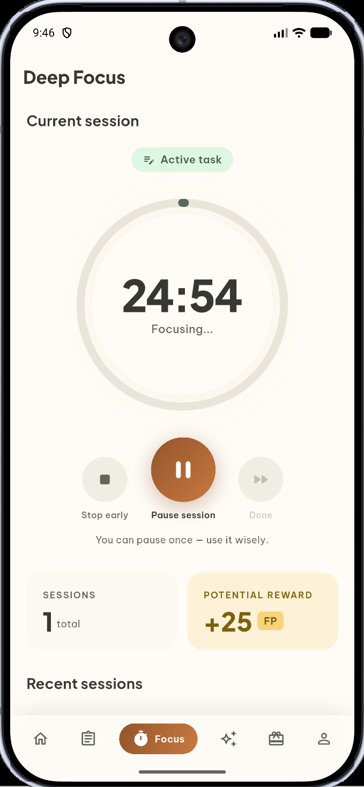
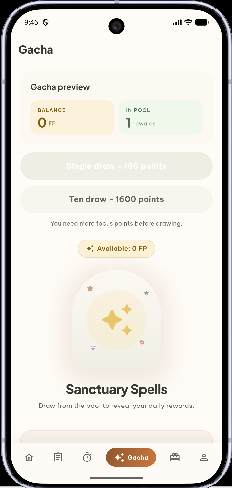
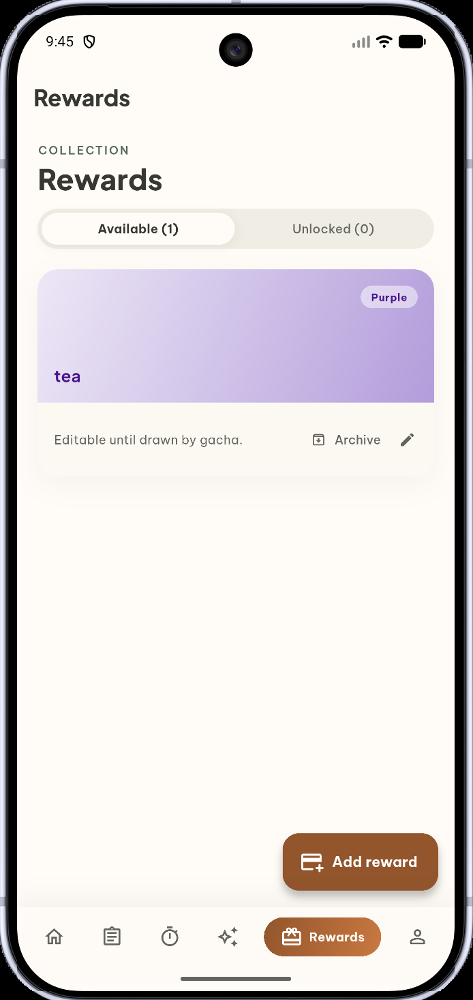
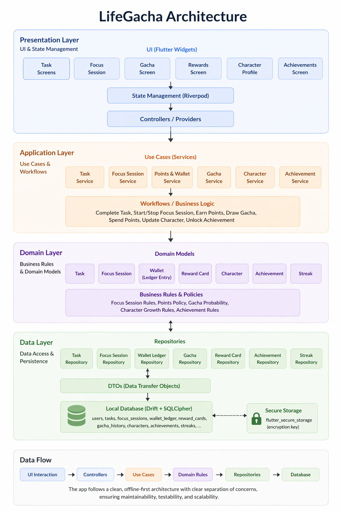

# 🎲 LifeGacha

> An offline-first productivity RPG that turns tasks, focus sessions, and daily consistency into points, rewards, gacha draws, and character growth.


LifeGacha makes productivity feel like progression. Complete real work, earn focus points, unlock self-defined rewards, pull from a gacha pool, build streaks, and grow a character over time - all stored locally with an encrypted offline-first database.

## Product Preview

| Dashboard | Focus |
| --- | --- |
|  |  |
| Track points, streaks, and daily progress. | Run focused work sessions and earn points. |

| Gacha | Rewards |
| --- | --- |
|  |  |
| Spend points to draw rewards from your own pool. | Create collectible reward cards with rarity tiers. |

## Architecture



## Why LifeGacha

Most productivity apps stop at checklists. LifeGacha adds a playful reward economy on top of serious task and focus workflows, so progress feels visible, collectible, and personal without requiring a cloud account or online service.

## Features

- ✅ **Task management** - Create, edit, archive, and complete tasks that feed the reward loop.
- ⏱️ **Focus sessions** - Run Pomodoro-style sessions with pause, stop, completion, and history tracking.
- 💎 **Focus points wallet** - Earn points from valid focus sessions and spend them on draws.
- 🎁 **Reward cards** - Create your own rewards, assign rarity, and keep drawn rewards out of the pool.
- 🎲 **Gacha draws** - Run single or ten-draw pulls with weighted rarity rules and result history.
- 📈 **Dashboard** - See balance, streak, tasks, sessions, and high-level progress at a glance.
- 🧬 **Character growth** - Convert productivity into XP, levels, attributes, and long-term progression.
- 🏅 **Achievements** - Unlock medals for completed tasks, focus sessions, points, streaks, and levels.
- 🔐 **Encrypted local storage** - Keep app data offline with Drift, sqlite, SQLCipher, and secure key storage.
- 🧪 **Tested workflows** - Domain, repository, controller, widget, and integration coverage for MVP flows.

## How It Works

1. **Create tasks** for the work you want to finish.
2. **Start a focus session** from a task and keep the app in the foreground.
3. **Complete the session** to earn focus points based on session length.
4. **Spend points** on gacha draws from your custom reward-card pool.
5. **Unlock rewards**, grow your character, build streaks, and collect achievements.

The core loop is simple: **focus -> earn -> draw -> grow -> repeat**.

## Tech Stack

| Layer | Technology |
| --- | --- |
| App | Flutter, Dart, Material 3 |
| State | Riverpod |
| Routing | GoRouter |
| Persistence | Drift, sqlite3, SQLCipher |
| Security | flutter_secure_storage, encrypted local database key |
| Utilities | uuid, crypto, path, path_provider, google_fonts |
| Testing | flutter_test, repository tests, widget tests, integration tests |

## Getting Started

### Prerequisites

- Flutter SDK
- Dart SDK
- Android Studio, Xcode, or another Flutter-supported device target

### Run locally

```bash
git clone https://github.com/your-org/life-gacha.git
cd life-gacha
flutter pub get
flutter run
```

### Verify the project

```bash
flutter analyze
flutter test
```

### Generate Drift files

Generated database files are committed. Only run code generation after changing the database schema.

```bash
dart run build_runner build --delete-conflicting-outputs
```

## Roadmap

- [x] Offline-first Flutter MVP foundation
- [x] Encrypted local database and repository layer
- [x] Tasks, focus sessions, wallet, reward cards, gacha, profile, and dashboard
- [x] Character growth, streaks, achievements, and activity history
- [x] Full MVP test coverage across core workflows
- [x] Add product screenshots to `docs/images`
- [ ] Polish screen transitions and empty states
- [ ] Expand long-term stats and multi-day progression views
- [ ] Add import/export or backup workflow
- [ ] Prepare first public release build

## Project Status

LifeGacha is a production-ready MVP foundation with implemented feature screens, encrypted persistence, deterministic business rules, and a tested offline core.

## License

License information will be added before public release.
